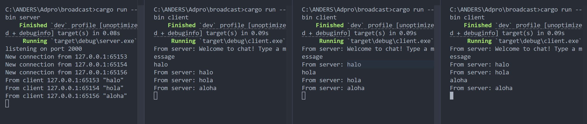
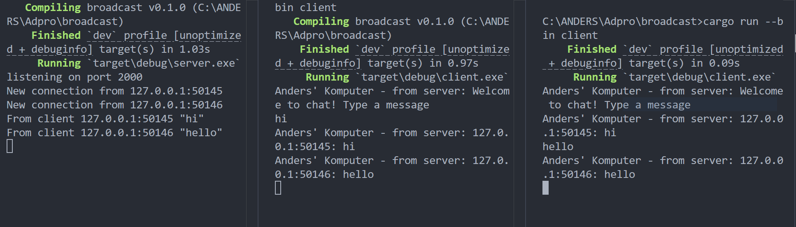

# Tutorial 10 (Broadcast)

## Reflection

### 2.1. Original code of broadcast chat



Start the server by executing `cargo run --bin server` in your terminal. Next, open three separate terminals and `run cargo run --bin client` in each one to start three clients. Each client, upon connecting, is greeted with a welcome message from the server and prompted to type a message. When a client sends a message, the message is broadcast to all connected clients as well as echoed back by the server.

### 2.2. Modifying the websocket port

```rust
let listener = TcpListener::bind("127.0.0.1:8080").await?;
println!("listening on port 8080");
```

To make sure the client connects properly to the server, both must use the same port and protocol. Initially, the server was listening on port 2000 while the client tried to connect to port 8080. I modified either the server's listening port to 8080 or the client's WebSocket connection URI to point to port 2000, so both sides matched.

### 2.3. Small changes. Add some information to client



I changed the messages printed by both the server and the client to make the output easier to identify in the console. When reading client output, it's immediately clear that the message is being displayed on "Anders’ Komputer". On the server side, I also made sure that all outgoing broadcast messages include the sender's IP and port.